# padelro.github.io

&lambda; ( [url](https://padelro.github.io/) )

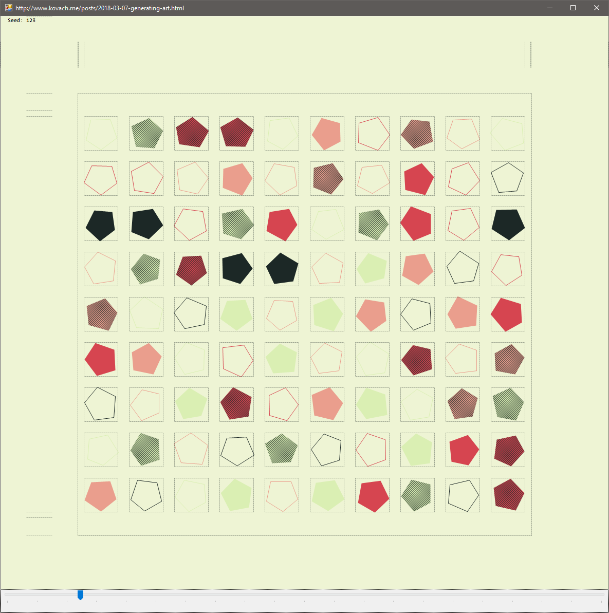
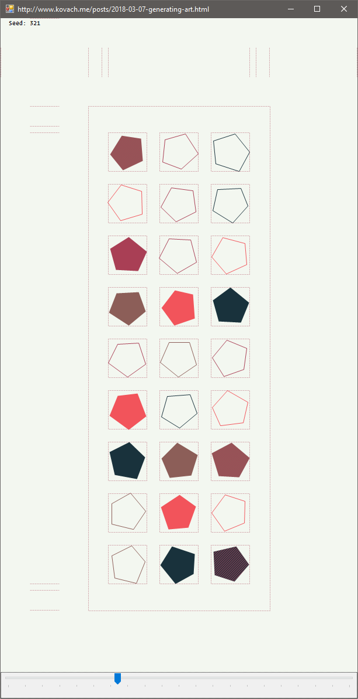
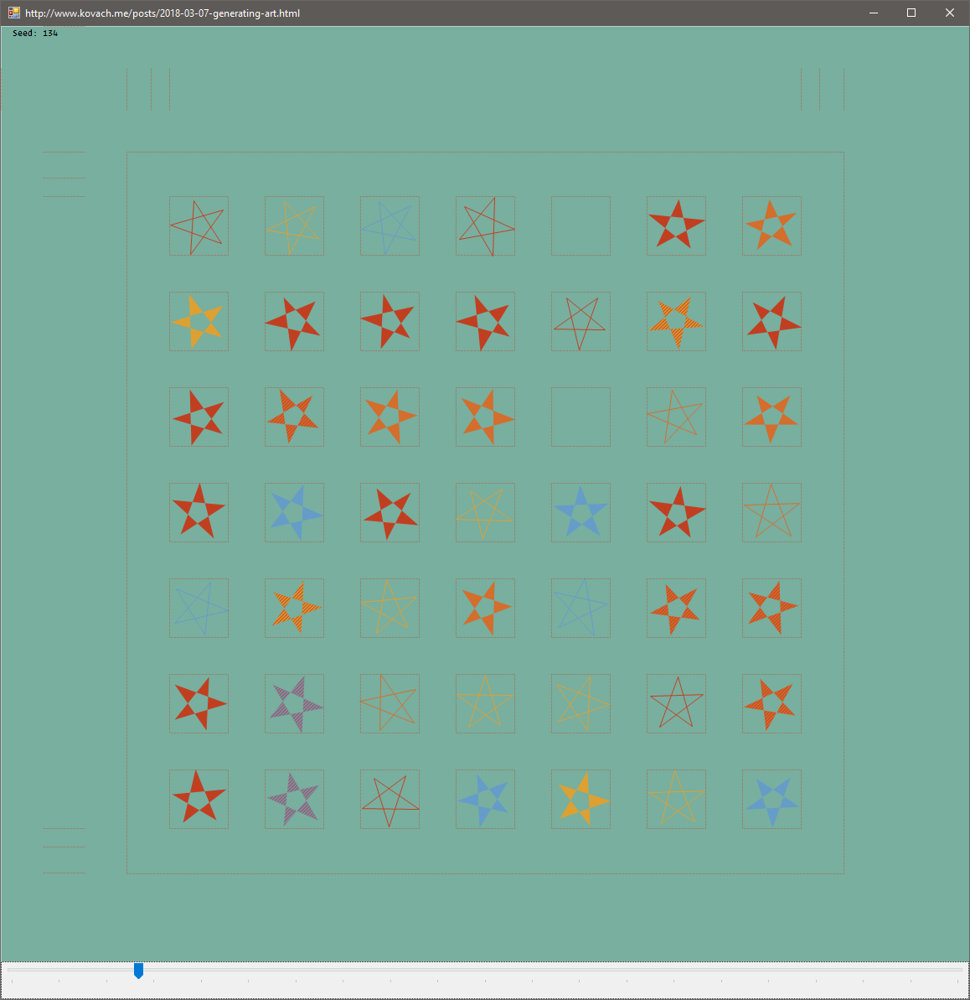

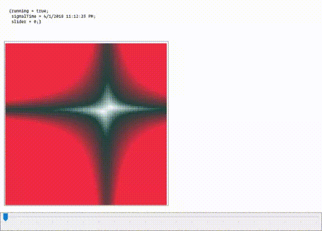

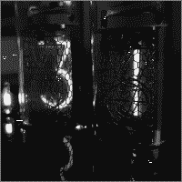

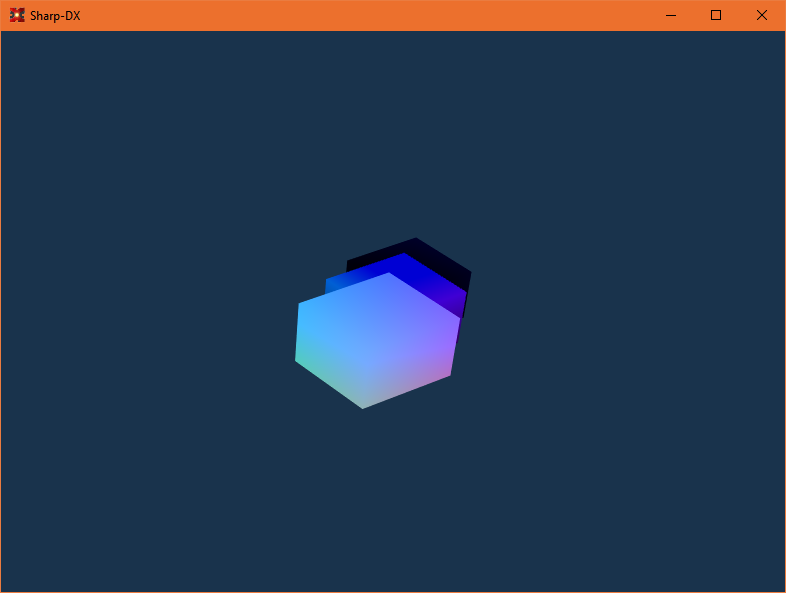

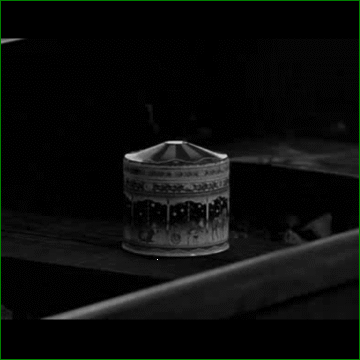

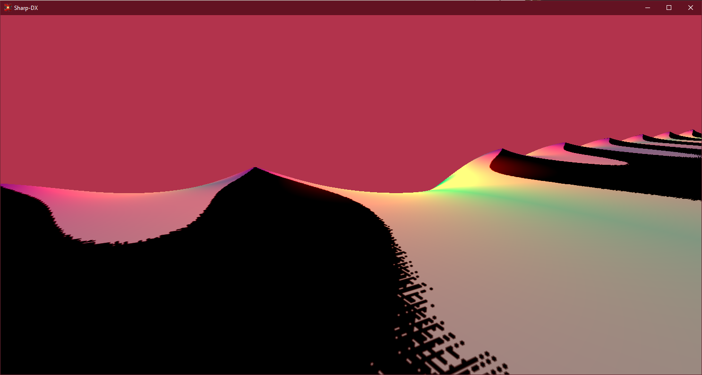

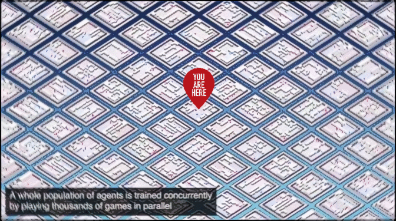

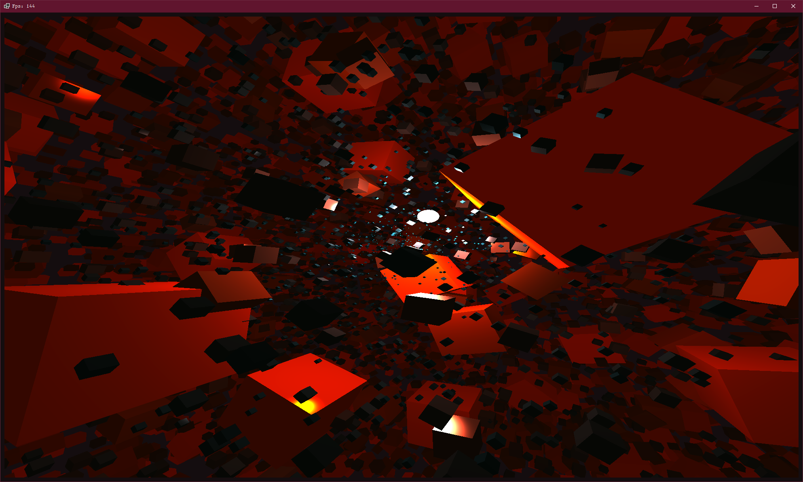

    --> Timing now on

    Real: 00:02:59.053, CPU: 00:15:42.562, GC gen0: 45647, gen1: 1647, gen2: 5
    val it : unit = ()

    --> Timing now off

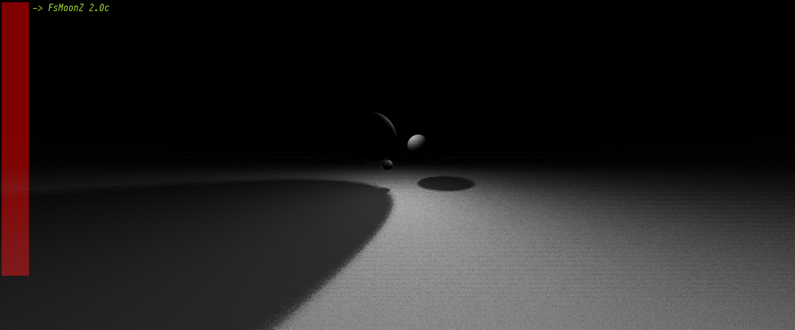

## Dummy build:

[Docs](https://padelro.github.io/build/build.html)
